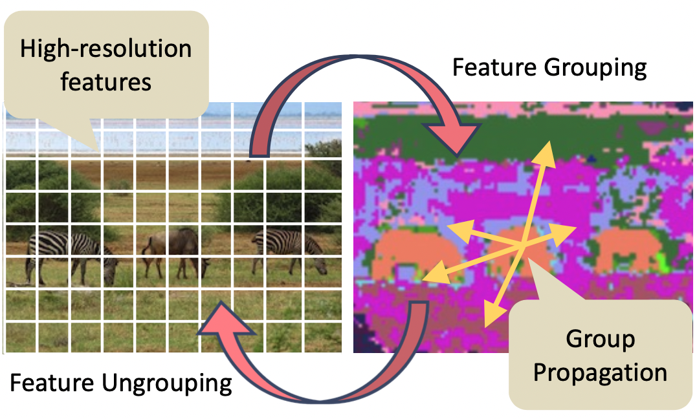

# GPViT: A High Resolution Non-Hierarchical Vision Transformer with Group Propagation
<p align="center">

</p>

GPViT is a high-resolution non-hierarchical vision transformer architecture designed for high-performing visual recognition. This repository contains the official PyTorch implementation of our paper:

[GPViT: A High Resolution Non-Hierarchical Vision Transformer with Group Propagation, *Chenhongyi Yang**, *Jiarui Xu**, *Shalini De Mello*, *Elliot J. Crowley*, *Xiaolong Wang*.](TBD)

## Usage

### Environment Setup
Our code base is built upon the MM-series toolkits. Specifically, classification is based on [MMClassification](); object detection is based on [MMDetection](); and semantic segmentation is based on [MMSegmentation](). Users can follow the official site of those toolkit to set up their environments. We also provide a sample setting up script as following:

```shell
conda create -n gpvit python=3.7 -y
source activate gpvit
pip install torch==1.7.1+cu101 torchvision==0.8.2+cu101 -f https://download.pytorch.org/whl/torch_stable.html
pip install -U openmim
mim install mmcv-full==1.4.8
pip install timm
pip install lmdb # for ImageNet experiments
pip install -v -e .
cd downstream/mmdetection  # setup object detection and instance segmentation
pip install -v -e . 
cd ../mmsegmentation # setup semantic segmentation
pip install -v -e .
```

### Data Preparation
Please follow [MMClassification](), [MMDetection]() and [MMSegmentation]() to set up the ImageNet, COCO and ADE20K datasets. For ImageNet experiment, we convert the dataset to LMDB format to accelerate training and testing. For example, you can convert you own dataset by running:
```shell
python tools/dataset_tools/create_lmdb_dataset.py \
       --train-img-dir data/imagenet/train \
       --train-out data/imagenet/imagenet_lmdb/train \
       --val_img_dir data/imagenet/val \
       --val-out data/imagenet/imagenet_lmdb/val
```
After setting up, the datasets file structure should be as follows:
```
GPViT
|-- data
|   |-- imagenet
|   |   |-- imagenet_lmdb
|   |   |   |-- train
|   |   |   |   |-- data.mdb
|   |   |   |   |-- lock.mdb
|   |   |   |-- val
|   |   |   |   |-- data.mdb
|   |   |   |   |-- lock.mdb 
|   |   |-- meta
|   |   |   |- ...
|-- downstream 
|   |-- mmsegmentation
|   |   |-- data
|   |   |   |-- ade
|   |   |   |   |-- ADEChallengeData2016
|   |   |   |   |   |-- annotations
|   |   |   |   |   |   |-- ...
|   |   |   |   |   |-- images
|   |   |   |   |   |   |-- ...
|   |   |   |   |   |-- objectInfo150.txt
|   |   |   |   |   |-- sceneCategories.txt
|   |   |-- ...
|   |-- mmdetection
|   |   |-- data
|   |   |   |-- coco
|   |   |   |   |-- train2017
|   |   |   |   |   |-- ...
|   |   |   |   |-- val2017
|   |   |   |   |   |-- ...
|   |   |   |   |-- annotations
|   |   |   |   |   |-- instances_train2017.json
|   |   |   |   |   |-- instances_val2017.json
|   |   |   |   |   |-- ...
|   |   |-- ...
|-- ...
``` 

### ImageNet classification
#### Training GPViT
```shell
# Example: Training GPViT-L1 model
zsh tool/dist_train.sh configs/gpvit/gpvit_l1.py 16 
```
#### Testing GPViT
```shell
# Example: Testing GPViT-L1 model
zsh tool/dist_test.sh configs/gpvit/gpvit_l1.py work_dirs/gpvit_l1/epoch_300.pth 16 --metrics accuracy
```
### COCO Object Detection and Instance Segmentation

#### Training GPViT based Mask R-CNN
```shell
# Example: Training GPViT-L1 models with 1x and 3x+MS schedules
zsh tools/dist_train.sh configs/gpvit/mask_rcnn/gpvit_l1_maskrcnn_1x.py 16
zsh tools/dist_train.sh configs/gpvit/mask_rcnn/gpvit_l1_maskrcnn_3x.py 16
```

#### Training GPViT based RetinaNet
```shell
# Example: Training GPViT-L1 models with 1x and 3x+MS schedules
zsh tools/dist_train.sh configs/gpvit/retinanet/gpvit_l1_retinanet_1x.py 16
zsh tools/dist_train.sh configs/gpvit/retinanet/gpvit_l4_retinanet_3x.py 16
```

#### Testing GPViT based Mask R-CNN
```shell
# Example: Testing GPViT-L1 Mask R-CNN 1x model
zsh tools/dist_test.sh configs/gpvit/mask_rcnn/gpvit_l1_maskrcnn_1x.py work_dirs/gpvit_l1_maskrcnn_1x/epoch_12.pth 16 --eval bbox segm
```

#### Testing GPViT based RetinaNet
```shell
# Example: Testing GPViT-L1 RetinaNet 1x model
zsh tools/dist_test.sh configs/gpvit/retinanet/gpvit_l1_retinanet_1x.py work_dirs/gpvit_l1_retinanet_1x/epoch_12.pth 16 --eval bbox
```

### ADE20K semantic segmentation
#### Training GPViT based semantic segmentation models
```shell
# Example: Training GPViT-L1 based SegFormer and UperNet models
zsh tools/dist_train.sh configs/gpvit/gpvit_l1_segformer.py 16
zsh tools/dist_train.sh configs/gpvit/gpvit_l1_upernet.py 16
```
#### Testing GPViT based semantic segmentation models
```shell
# Example: Testing GPViT-L1 based SegFormer and UperNet models
zsh tools/dist_test.sh configs/gpvit/gpvit_l1_segformer.py work_dirs/gpvit_l1_segformer/iter_160000.pth 16 --eval mIoU
zsh tools/dist_test.sh configs/gpvit/gpvit_l1_upernet.py work_dirs/gpvit_l1_upernet/iter_160000.pth 16 --eval mIoU
```

## Benchmark results

### ImageNet-1k classification
|   Model  | #Params (M) | Top-1 Acc | Top-5 Acc |   Config   |   Model   |
|:--------:|:-----------:|:---------:|:---------:|:----------:|:---------:|
| GPViT-L1 |     9.3     |    80.5   |    95.4   | [config](https://github.com/ChenhongyiYang/GPViT/blob/main/configs/gpvit/gpvit_l1.py) | [model]() |
| GPViT-L2 |    23.8     |    83.4   |    96.6   | [config](https://github.com/ChenhongyiYang/GPViT/blob/main/configs/gpvit/gpvit_l2.py) | [model]() |
| GPViT-L3 |    36.2     |    84.1   |    96.9   | [config](https://github.com/ChenhongyiYang/GPViT/blob/main/configs/gpvit/gpvit_l3.py) | [model]() |
| GPViT-L4 |    75.4     |    84.3   |    96.9   | [config](https://github.com/ChenhongyiYang/GPViT/blob/main/configs/gpvit/gpvit_l4.py) | [model]() |

### COCO Mask R-CNN 1x Schedule
|   Model  | #Params (M) | AP Box | AP Mask |   Config   |   Model   |
|:--------:|:-----------:|:------:|:-------:|:----------:|:---------:|
| GPViT-L1 |      33     |  48.1  |   42.7  | [config](https://github.com/ChenhongyiYang/GPViT/blob/main/downstream/mmdetection/configs/gpvit/mask_rcnn/gpvit_l1_maskrcnn_1x.py) | [model]() |
| GPViT-L2 |      50     |  49.9  |   43.9  | [config](https://github.com/ChenhongyiYang/GPViT/blob/main/downstream/mmdetection/configs/gpvit/mask_rcnn/gpvit_l2_maskrcnn_1x.py) | [model]() |
| GPViT-L3 |      64     |  50.4  |   44.4  | [config](https://github.com/ChenhongyiYang/GPViT/blob/main/downstream/mmdetection/configs/gpvit/mask_rcnn/gpvit_l3_maskrcnn_1x.py) | [model]() |
| GPViT-L4 |     109     |  51.0  |   45.0  | [config](https://github.com/ChenhongyiYang/GPViT/blob/main/downstream/mmdetection/configs/gpvit/mask_rcnn/gpvit_l4_maskrcnn_1x.py) | [model]() |

### COCO Mask R-CNN 3x+MS Schedule
|   Model  | #Params (M) | AP Box | AP Mask |   Config   |   Model   |
|:--------:|:-----------:|:------:|:-------:|:----------:|:---------:|
| GPViT-L1 |      33     |  50.2  |   44.3  | [config](https://github.com/ChenhongyiYang/GPViT/blob/main/downstream/mmdetection/configs/gpvit/mask_rcnn/gpvit_l1_maskrcnn_3x.py) | [model]() |
| GPViT-L2 |      50     |  51.4  |   45.1  | [config](https://github.com/ChenhongyiYang/GPViT/blob/main/downstream/mmdetection/configs/gpvit/mask_rcnn/gpvit_l2_maskrcnn_3x.py) | [model]() |
| GPViT-L3 |      64     |  51.6  |   45.2  | [config](https://github.com/ChenhongyiYang/GPViT/blob/main/downstream/mmdetection/configs/gpvit/mask_rcnn/gpvit_l3_maskrcnn_3x.py) | [model]() |
| GPViT-L4 |     109     |  52.1  |   45.7  | [config](https://github.com/ChenhongyiYang/GPViT/blob/main/downstream/mmdetection/configs/gpvit/mask_rcnn/gpvit_l4_maskrcnn_3x.py) | [model]() |

### COCO RetinaNet 1x Schedule
|   Model  | #Params (M) | AP Box |   Config   |   Model   |
|:--------:|:-----------:|:------:|:----------:|:---------:|
| GPViT-L1 |      21     |  45.8  | [config](https://github.com/ChenhongyiYang/GPViT/blob/main/downstream/mmdetection/configs/gpvit/retinanet/gpvit_l1_retinanet_1x.py) | [model]() |
| GPViT-L2 |      37     |  48.0  | [config](https://github.com/ChenhongyiYang/GPViT/blob/main/downstream/mmdetection/configs/gpvit/retinanet/gpvit_l2_retinanet_1x.py) | [model]() |
| GPViT-L3 |      52     |  48.3  | [config](https://github.com/ChenhongyiYang/GPViT/blob/main/downstream/mmdetection/configs/gpvit/retinanet/gpvit_l3_retinanet_1x.py) | [model]() |
| GPViT-L4 |      96     |  48.7  | [config](https://github.com/ChenhongyiYang/GPViT/blob/main/downstream/mmdetection/configs/gpvit/retinanet/gpvit_l4_retinanet_1x.py) | [model]() |

### COCO RetinaNet 3x+MS Schedule
|   Model  | #Params (M) | AP Box |   Config   |   Model   |
|:--------:|:-----------:|:------:|:----------:|:---------:|
| GPViT-L1 |      21     |  48.1  | [config](https://github.com/ChenhongyiYang/GPViT/blob/main/downstream/mmdetection/configs/gpvit/retinanet/gpvit_l1_retinanet_3x.py) | [model]() |
| GPViT-L2 |      37     |  49.0  | [config](https://github.com/ChenhongyiYang/GPViT/blob/main/downstream/mmdetection/configs/gpvit/retinanet/gpvit_l2_retinanet_3x.py) | [model]() |
| GPViT-L3 |      52     |  49.4  | [config](https://github.com/ChenhongyiYang/GPViT/blob/main/downstream/mmdetection/configs/gpvit/retinanet/gpvit_l3_retinanet_3x.py) | [model]() |
| GPViT-L4 |      96     |  49.8  | [config](https://github.com/ChenhongyiYang/GPViT/blob/main/downstream/mmdetection/configs/gpvit/retinanet/gpvit_l4_retinanet_3x.py) | [model]() |

### ADE20K UperNet
|   Model  | #Params (M) | mIoU |   Config   |   Model   |
|:--------:|:-----------:|:----:|:----------:|:---------:|
| GPViT-L1 |      37     | 49.1 | [config](https://github.com/ChenhongyiYang/GPViT/blob/main/downstream/mmsegmentation/configs/gpvit/gpvit_l1_upernet.py) | [model]() |
| GPViT-L2 |      53     | 50.2 | [config](https://github.com/ChenhongyiYang/GPViT/blob/main/downstream/mmsegmentation/configs/gpvit/gpvit_l2_upernet.py) | [model]() |
| GPViT-L3 |      66     | 51.7 | [config](https://github.com/ChenhongyiYang/GPViT/blob/main/downstream/mmsegmentation/configs/gpvit/gpvit_l3_upernet.py) | [model]() |
| GPViT-L4 |     107     | 52.5 | [config](https://github.com/ChenhongyiYang/GPViT/blob/main/downstream/mmsegmentation/configs/gpvit/gpvit_l14_upernet.py) | [model]() |

### ADE20K SegFormer
|   Model  | #Params (M) | mIoU |   Config   |   Model   |
|:--------:|:-----------:|:----:|:----------:|:---------:|
| GPViT-L1 |      9      | 46.9 | [config](https://github.com/ChenhongyiYang/GPViT/blob/main/downstream/mmsegmentation/configs/gpvit/gpvit_l1_segformer.py) | [model]() |
| GPViT-L2 |      24     | 49.2 | [config](https://github.com/ChenhongyiYang/GPViT/blob/main/downstream/mmsegmentation/configs/gpvit/gpvit_l2_segformer.py) | [model]() |
| GPViT-L3 |      36     | 50.8 | [config](https://github.com/ChenhongyiYang/GPViT/blob/main/downstream/mmsegmentation/configs/gpvit/gpvit_l3_segformer.py) | [model]() |
| GPViT-L4 |      76     | 51.3 | [config](https://github.com/ChenhongyiYang/GPViT/blob/main/downstream/mmsegmentation/configs/gpvit/gpvit_l14_segformer.py) | [model]() |


## Citation
```
TBD
```

